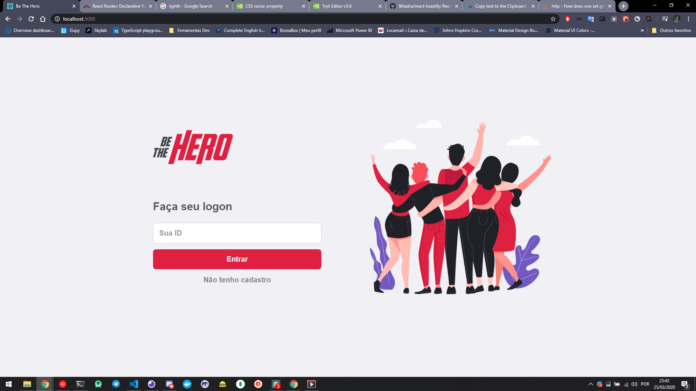
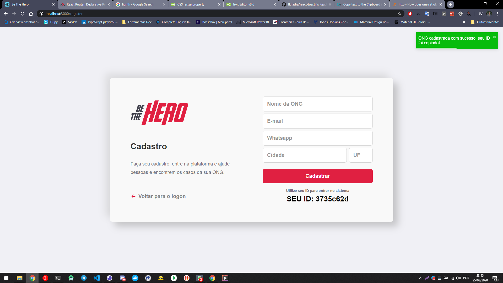
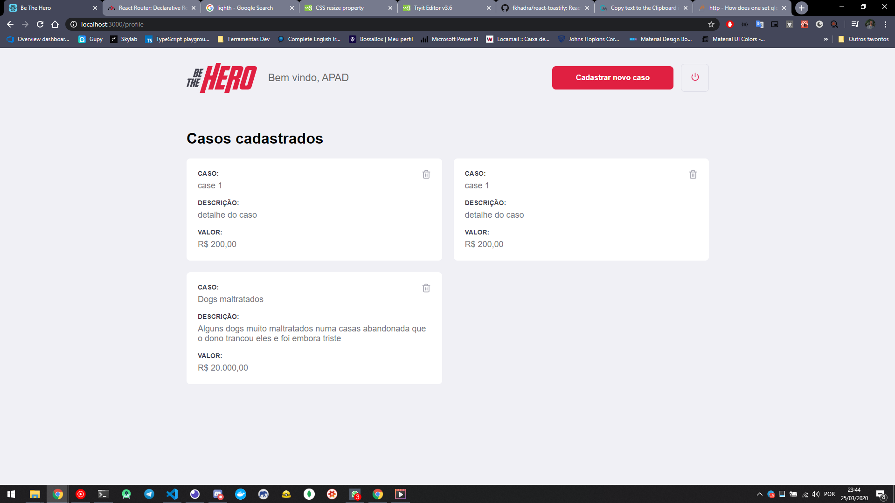
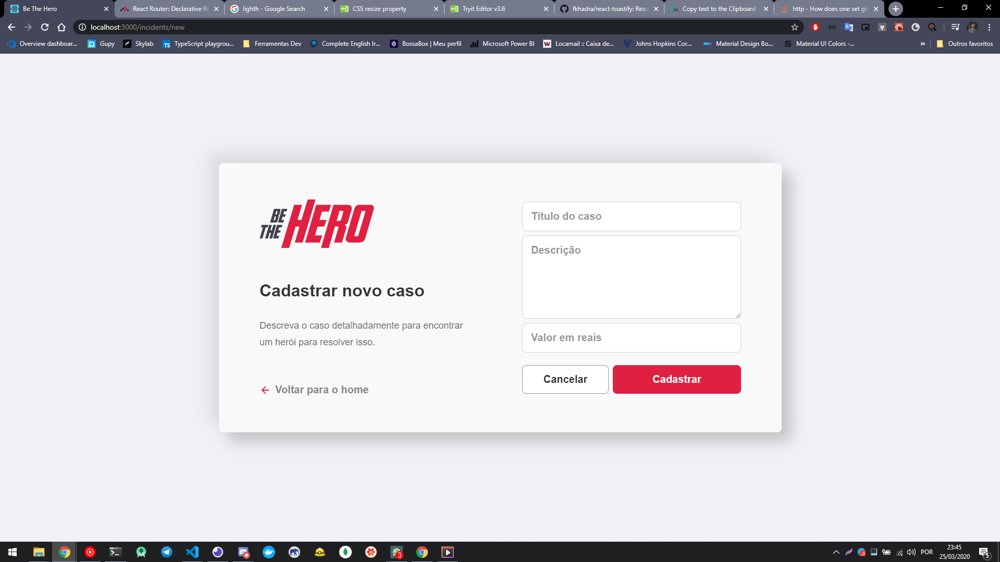

<h1 align="center">
    
</h1>

<h3 align="center">
  💜🦸‍♀️ Be The Hero 🦹‍♂️🆘
</h3>
 
# Frontend

  <a href="#rocket-sobre-o-desafio">Sobre</a>&nbsp;&nbsp;&nbsp;|&nbsp;&nbsp;&nbsp;
  <a href='#gear-oque-foi-utilizado'>Oque foi utilizado</a>&nbsp;&nbsp;&nbsp;|&nbsp;&nbsp;&nbsp;
  <a href="#camera-imagens">Imagens</a>

## 🦸‍♀️ Sobre

O <strong>Be The Hero</strong> é uma plataforma para ongs possa achar heróis que possam ajudá-los nas causas que elas têm.
Projeto criado na <strong>Semana OmniStack 11</strong>.

## ⚙️ Oque foi utilizado
<ul>
  <li>UnForm</li>
  <li>React</li>
  <li>Styled Components</li>
  <li>React hooks</li>
  <li>Axios</li>
  <li>polished</li>
  <li>React Toastify</li>
  <li>React Icons</li>
  <li>copy-to-clipboard</li>
</ul>

## 📷 Imagens

<strong>Login</strong>

 
<strong>Registro</strong>

 
<strong>Perfil da Ong e listagem dos casus.</strong>

 
<strong>Cadastro de casus.</strong>

