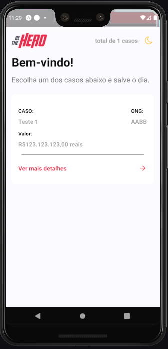
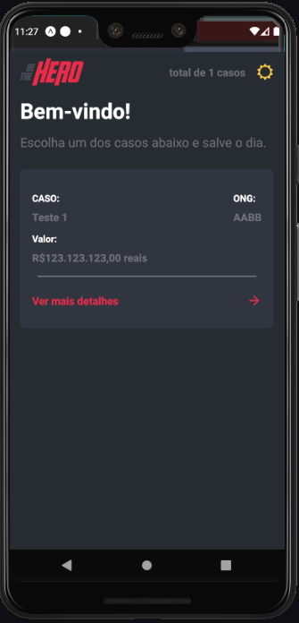
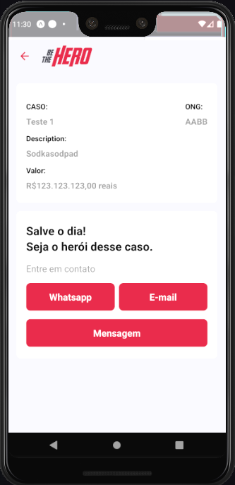
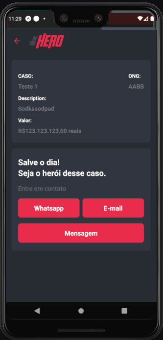

<h1 align="center">
    
</h1>

<h3 align="center">
  💜🦸‍♀️ Be The Hero 🦹‍♂️🆘
</h3>

  <a href="#rocket-sobre-o-desafio">Sobre</a>&nbsp;&nbsp;&nbsp;|&nbsp;&nbsp;&nbsp;
  <a href='#gear-oque-foi-utilizado'>Oque foi utilizado</a>&nbsp;&nbsp;&nbsp;|&nbsp;&nbsp;&nbsp;
  <a href="#camera-imagens">Imagens</a>

## 🆘 Sobre

O <strong>Be The Hero</strong> é uma plataforma para ongs possa achar heróis que possam ajudá-los nas causas que elas têm.
Projeto criado na <strong>Semana OmniStack 11</strong>.

## ⚙️ Oque foi utilizado
<ul>
  <li>Expo</li>
  <li>React Native</li>
  <li>Styled Components</li>
  <li>React hooks</li>
  <li>Axios</li>
  <li>polished</li>
  <li>prop-types</li>
  <li>Prettier</li>
  <li>ESlint</li>
</ul>

## 📷 Imagens

<strong>Caos</strong>

  
  

 
<strong>Detalhes</strong>

  
  

 

